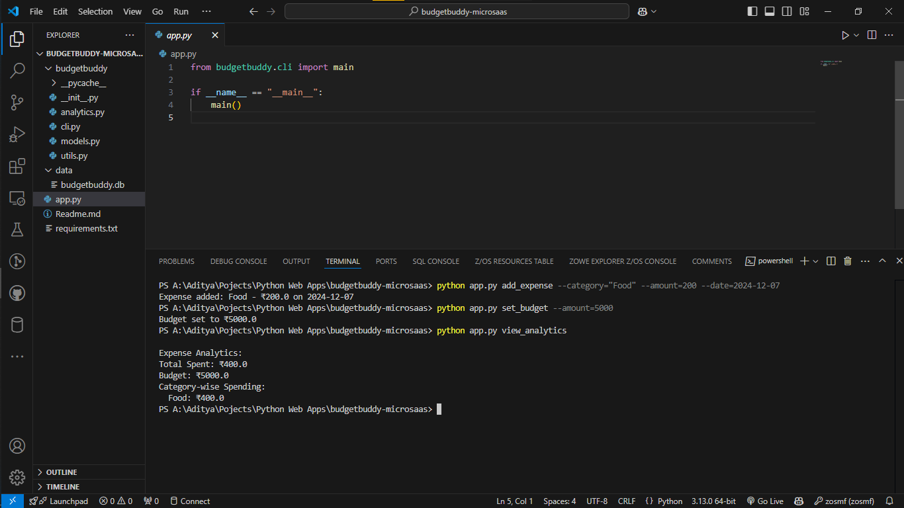

# BudgetBuddy: Personalized Expense Tracker and Optimizer

BudgetBuddy is a lightweight MicroSaaS application designed to help individuals and students manage their expenses effortlessly. It provides a simple interface for logging expenses, setting budgets, and viewing analytics.

---

## How It Works

1. Logging Expenses:
- Users can add expenses by specifying the category (e.g., food, transport), amount, and date. This information is stored in a database.

2. Setting a Budget:
- Users can define a monthly spending limit. The app tracks the total expenses against this budget and alerts users if they overspend.

3. Viewing Analytics:
- Users can view their total spending, category-wise breakdown, and check if they’re within their budget. Analytics helps users understand their spending patterns and make better financial decisions.

---

## Features
- **Daily Expense Logging:** Track expenses by category, amount, and date.
- **Budget Tracking:** Set a monthly budget and get alerted on overspending.
- **Analytics Dashboard:** View total spent, category-wise distribution, and trends.

---

## Advantages
- Simple and Focused: Provides essential features without overwhelming users with unnecessary complexity.
- Customizable: Users can categorize expenses and set their own budget limits.
- Data-Driven Decisions: Analytics help users identify spending habits and make adjustments to stay within their budget.
- Lightweight: Requires minimal resources to run and manage.

---

## Real-World Problem Solved
Many individuals struggle to manage their daily expenses due to a lack of proper tracking and analysis. BudgetBuddy addresses this problem by offering:

- A quick way to log expenses, ensuring users don't forget their spending details.
- Overspending alerts, helping users stay financially disciplined.
- A visual breakdown of spending patterns, enabling smarter financial planning.

---

## File Structure and Explanation
<h2>BudgetBuddy MicroSaaS</h2>

<p>A lightweight MicroSaaS solution for managing budgets and analyzing expenses.</p>

<pre>
<b>budgetbuddy-microsaas/</b>
│
├── <b>app.py</b>                 # Main entry point for the application
├── <b>budgetbuddy/</b>           # Package containing core functionality
│   ├── <b>__init__.py</b>        # Initializes the budgetbuddy package
│   ├── <b>models.py</b>          # Database initialization and schema definition
│   ├── <b>cli.py</b>             # Command-line interface logic
│   ├── <b>utils.py</b>           # Helper functions for expenses, budget, etc.
│   ├── <b>analytics.py</b>       # Expense analysis and reporting
│
├── <b>data/</b>
│   └── <b>budgetbuddy.db</b>     # SQLite database file (created automatically)
│
├── <b>requirements.txt</b>       # Python dependencies
└── <b>README.md</b>              # Project documentation
</pre>

### Explanation of Files

<h2>Explanation of Files</h2>

<ul>
    <li>
        <b>app.py</b><br>
        The entry point for the application. It calls the command-line interface (CLI) to process user commands.
    </li>
    <li>
        <b>budgetbuddy/__init__.py</b><br>
        An empty file that marks <code>budgetbuddy</code> as a Python package.
    </li>
    <li>
        <b>budgetbuddy/models.py</b><br>
        Handles database initialization and schema creation:
        <ul>
            <li><b>Expenses Table:</b> Stores category, amount, and date for each expense.</li>
            <li><b>Budget Table:</b> Stores the user's monthly budget.</li>
        </ul>
    </li>
    <li>
        <b>budgetbuddy/cli.py</b><br>
        Defines the command-line interface for the app:
        <ul>
            <li><b>add_expense:</b> Log an expense with category, amount, and date.</li>
            <li><b>set_budget:</b> Set a monthly budget.</li>
            <li><b>view_analytics:</b> Display spending analytics.</li>
        </ul>
    </li>
    <li>
        <b>budgetbuddy/utils.py</b><br>
        Contains utility functions:
        <ul>
            <li><b>add_expense:</b> Saves an expense to the database.</li>
            <li><b>set_budget:</b> Saves or updates the budget.</li>
            <li><b>view_analytics:</b> Fetches analytics data from the database.</li>
        </ul>
    </li>
    <li>
        <b>budgetbuddy/analytics.py</b><br>
        Provides analytical insights:
        <ul>
            <li>Calculates total spending.</li>
            <li>Breaks down spending by category.</li>
            <li>Checks if the user has exceeded their budget and provides warnings.</li>
        </ul>
    </li>
    <li>
        <b>data/budgetbuddy.db</b><br>
        SQLite database file that stores user data (created automatically when you run the app for the first time).
    </li>
    <li>
        <b>requirements.txt</b><br>
        Lists Python dependencies required for the application.
    </li>
    <li>
        <b>README.md</b><br>
        The project documentation you’re reading right now.
    </li>
</ul>


---

## How It Solves a Real-World Problem
1. **Personal Finance Management:**
- BudgetBuddy simplifies expense tracking for individuals who don’t want to use complex financial apps.

2. **Overspending Control:**
- By setting budgets and getting alerts, users can avoid financial strain caused by overspending.

3. **Insights for Better Decisions:**
- Visualizing spending patterns helps users adjust their habits and save money over time.

---


## Setup Instructions
### Prerequisites
- Python 3.8 or higher
- `pip` (Python package manager)

### Installation
1. Clone the repository:
   ```bash
   git clone https://github.com/AdityaSrivastavDS/budgetbuddy-microsaas
   cd budgetbuddy-microsaas
   ```

2. Install dependencies:
```bash
pip install -r requirements.txt
```

3. Initialize the database:
```bash
python app.py
```

# Usage
## Commands

1. Add an Expense:
```bash
python app.py add_expense --category="Food" --amount=200 --date=2024-12-07
```

2. Set a Monthly Budget:
```bash
python app.py set_budget --amount=5000
```

3. View Analytics:
```bash
python app.py view_analytics
```

## Example Output

### Analytics:

```bash
Expense Analytics:
Total Spent: ₹2000
Budget: ₹5000
Category-wise Spending:
  Food: ₹1500
  Transport: ₹500
```
---

## View


---

## Future Improvements
- Add a web or mobile interface for better usability.
- Integrate with payment systems for automated expense logging.
- Provide advanced analytics like trends, predictions, and comparisons.
- Enable cloud storage for cross-device access.

---

## License
- This project is licensed under the MIT License.